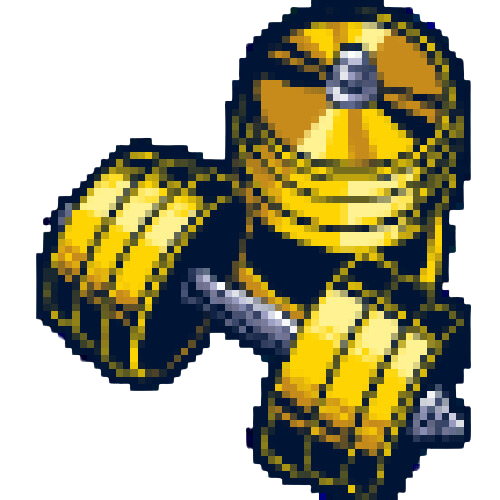
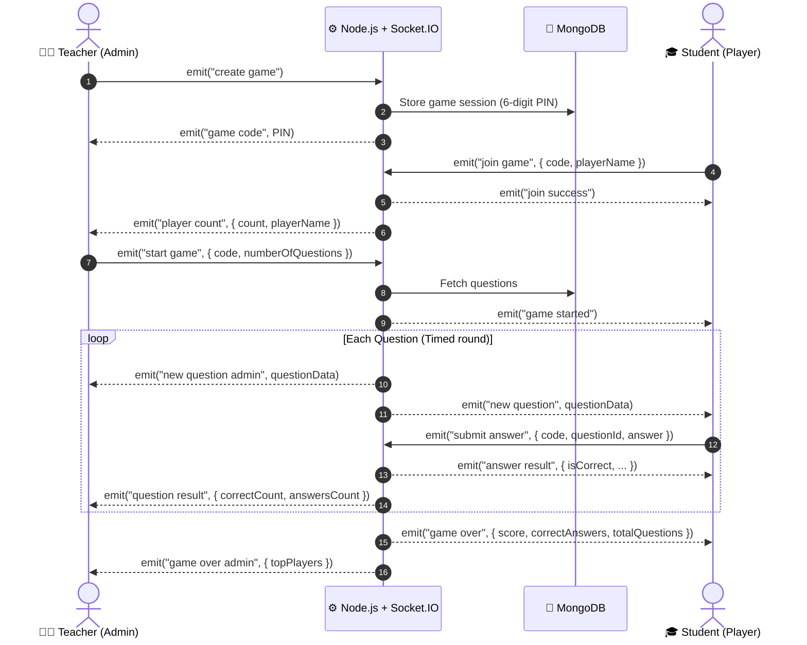

<div align="center">

  <picture>
    <source media="(prefers-color-scheme: dark)" srcset="public/smarter-logo-white.png">
    <source media="(prefers-color-scheme: light)" srcset="public/smarter%20logo.png">
    
  </picture>

  # 🎓 SMARTER
  ### Interactive Real-Time Educational Gaming & Quiz Platform
  *Plateforme d'apprentissage ludique et compétitive en temps réel*

  <p align="center">
    <a href="#-key-features">Features</a> •
    <a href="#-architecture--game-flow">Architecture</a> •
    <a href="#-screenshots">Screenshots</a> •
    <a href="#-tech-stack">Tech Stack</a> •
    <a href="#-getting-started">Getting Started</a> •
    <a href="#-websocket-events">API & Events</a> •
    <a href="#-license">License</a>
  </p>

  [](https://nodejs.org/)
  [](https://expressjs.com/)
  [](https://socket.io/)
  [](https://www.mongodb.com/)
  [](https://tailwindcss.com/)
  [](LICENSE)

</div>

---

## 📖 Overview

**SMARTER** is a synchronous, real-time multiplayer educational quiz platform designed to transform classroom dynamics and remote learning. Inspired by platforms like Kahoot! and Quizizz, SMARTER empowers teachers to host live question sessions where students join via a unique 6-digit PIN code, answer timed questions, and compete on dynamic leaderboards in real time.

It also features an autonomous **Training Mode** (Entraînement) allowing students to practice and self-assess using randomized questions extracted directly from the knowledge base.

---

## ✨ Key Features

| Category | Capability | Description |
| :--- | :--- | :--- |
| ⚡ **Real-Time Multiplayer** | **Low-Latency WebSockets** | Powered by Socket.io for instant synchronization across all participants. |
| 👨‍🏫 **Teacher Control Room** | **Session Host Dashboard** | Generate dynamic 6-digit game PINs, configure question counts, track joiners, and start the game live. |
| 🎮 **Student Arena** | **Interactive Answering** | Frictionless entry with PIN + Nickname, instant response feedback, timed question countdowns. |
| 🏆 **Live Leaderboard** | **Podium & Final Scoring** | Auto-ranked podium showcasing the top 3 players at completion with detailed personal score breakdown. |
| 🏋️ **Solo Training Mode** | **Self-Paced Practice** | Randomized single-player quiz session (`/entrainement.html`) querying the MongoDB question pool. |
| 📊 **Excel Integration** | **Automated Ingestion** | Batch import questions with correct & distractor answers straight from `.xlsx` spreadsheets. |
| 🌐 **Multilingual Ready** | **Arabic & French & English** | Full RTL (Right-to-Left) Arabic support alongside Latin layouts. |
| 📱 **Responsive UI** | **Mobile & Desktop** | Tailwind CSS styled interface crafted for smartphones, tablets, and desktop projectors. |

---

## 📸 Screenshots & Interface Showcase

<div align="center">
  <table>
    <tr>
      <td width="50%" align="center">
        <b>Game Room & Code Creation</b><br/>
        
      </td>
      <td width="50%" align="center">
        <b>Live In-Game Question Screen</b><br/>
        
      </td>
    </tr>
    <tr>
      <td width="50%" align="center">
        <b>Solo Training Arena</b><br/>
        
      </td>
      <td width="50%" align="center">
        <b>Final Results & Podium</b><br/>
        
      </td>
    </tr>
  </table>
</div>

---

## 🏗️ Architecture & Game Flow

The platform relies on event-driven bidirectional communication between the server and clients:



---

## 💻 Tech Stack

### **Backend & Real-Time Engine**
- **Runtime**: [Node.js](https://nodejs.org/) (ES6+)
- **Framework**: [Express.js](https://expressjs.com/) (REST APIs & static asset serving)
- **WebSockets**: [Socket.io](https://socket.io/) (High-performance room management and event dispatching)
- **Database**: [MongoDB](https://www.mongodb.com/) via native official driver `mongodb`
- **Security**: [bcrypt](https://github.com/kelektiv/node.bcrypt.js) for password hashing

### **Frontend & Design**
- **Structure**: Semantic HTML5 with dynamic vanilla JavaScript clients
- **Styling**: [Tailwind CSS 3.4](https://tailwindcss.com/) + Custom CSS animations
- **Typography & Icons**: Google Fonts (*Cairo*, *Gagalin*), FontAwesome 6
- **Asset Processing**: [xlsx (SheetJS)](https://sheetjs.com/) for spreadsheet ingestion

---

## 🚀 Getting Started

### Prerequisites

Ensure you have the following installed on your machine:
- [Node.js](https://nodejs.org/) (v16.x or higher)
- [npm](https://www.npmjs.com/) (v8.x or higher)
- [MongoDB](https://www.mongodb.com/try/download/community) installed and running locally, or a [MongoDB Atlas](https://www.mongodb.com/atlas) URI

### 1. Clone the Repository

```bash
git clone https://github.com/anasschenguiti/smarter-quiz-platform.git
cd smarter-quiz-platform
```

### 2. Install Dependencies

```bash
npm install
```

### 3. Configure Environment Variables

Create a `.env` file in the project root:

```env
PORT=3000
MONGODB_URI=mongodb://127.0.0.1:27017/game
```

> **Note**: If you are using MongoDB Atlas, replace `MONGODB_URI` with your connection string:
> `MONGODB_URI=mongodb+srv://<username>:<password>@cluster.mongodb.net/game?retryWrites=true&w=majority`

### 4. Populate the Question Database

The project includes an Excel question seed file `Q SMARTER 2023.xlsx`. To import the questions into MongoDB:

```bash
node insertquestions.js
```

Expected output:
```text
Connected to MongoDB
Existing data deleted.
Questions read from Excel: [...]
X questions inserted successfully!
MongoDB connection closed
```

### 5. Launch the Server

Start the application:

```bash
npm start
# or: node server.js
```

The server will be running at **`http://localhost:3000`**.

---

## 🕹️ How to Play

### 👨‍🏫 Hosting a Quiz (Teacher / Admin)
1. Open `http://localhost:3000/create-join.html` and click on **Teacher / Create Game** (or go to `/admin.html`).
2. A unique **6-digit game PIN** is generated.
3. Share the PIN code on the projector or classroom screen.
4. Watch players join the lobby in real time.
5. Select the number of questions and click **Start Game**.
6. Monitor live stats and view the final podium!

### 🎓 Joining a Quiz (Student)
1. Open `http://localhost:3000/create-join.html` and select **Student / Join Game** (or go to `/student.html`).
2. Enter your **Nickname** and the **6-digit Game PIN**.
3. When the teacher starts the quiz, select your answer before the timer expires.
4. Track your score and position on the leaderboard!

### 🏋️ Solo Training
- Visit `http://localhost:3000/entrainement.html` to practice questions at your own pace with instant validation.

---

## 📂 Project Structure

```text
smarter-quiz-platform/
├── public/                       # Client-side web assets
│   ├── index.html                # Landing page & portal
│   ├── create-join.html          # Role selection (Teacher vs Student)
│   ├── admin.html                # Teacher host interface & control panel
│   ├── student.html              # Student real-time player interface
│   ├── entrainement.html         # Solo training practice arena
│   ├── auth.html                 # Login / Registration modal
│   ├── css/
│   │   ├── tailwind.css          # Tailwind CSS source definitions
│   │   └── styles.css            # Compiled production styles
│   ├── js/
│   │   ├── admin.js              # Admin Socket.io event logic
│   │   └── student.js            # Student Socket.io event logic
│   └── *.png, *.jpg              # Logos, banners & UI illustrations
├── .env                          # Environment variables configuration
├── insertquestions.js            # Bulk Excel-to-MongoDB migration script
├── package.json                  # Node dependencies & project metadata
├── Q SMARTER 2023.xlsx           # Question bank dataset
├── server.js                     # Main Express & Socket.io server
├── tailwind.config.js            # Tailwind styling configurations
└── README.md                     # Documentation
```

---

## 📡 Socket.IO Real-Time Events Reference

| Event Name | Direction | Payload | Description |
| :--- | :--- | :--- | :--- |
| `create game` | Client ➔ Server | *none* | Requests creation of a new room with a random 6-digit code. |
| `game code` | Server ➔ Client | `code: string` | Returns the newly allocated game code to the admin. |
| `join game` | Client ➔ Server | `{ code, playerName }` | Player requests to enter the specified game session. |
| `join success` | Server ➔ Client | `{ message, playerName }` | Confirmation that player successfully joined the lobby. |
| `player count` | Server ➔ Admin | `{ count, playerName }` | Notifies the host room that a new participant entered. |
| `start game` | Admin ➔ Server | `{ code, numberOfQuestions }` | Initiates the match and kicks off the question cycle. |
| `new question` | Server ➔ Players| `{ question, options, timeLimit }` | Broadcasts the next active question to students. |
| `submit answer` | Player ➔ Server| `{ code, questionId, answer }` | Transmits a player's selected option. |
| `answer result` | Server ➔ Player| `{ isCorrect, score, ... }` | Sends immediate private feedback to the answering player. |
| `question result` | Server ➔ Admin | `{ answersCount, correctCount }` | Aggregate statistics for the host screen. |
| `game over` | Server ➔ Players| `{ score, correctAnswers, ... }` | Final game summary sent to each player. |
| `game over admin` | Server ➔ Admin | `{ topPlayers: [...] }` | Final podium data delivered to the host. |

---

## 🗄️ Database Models

### Games (`games` collection)
```json
{
  "_id": "ObjectId('...')",
  "code": "849201",
  "admin": "socket_id_admin",
  "players": ["socket_id_1", "socket_id_2"],
  "questions": [...],
  "currentQuestion": 0,
  "pendingAnswers": {},
  "scores": {
    "socket_id_1": 1500,
    "socket_id_2": 800
  },
  "playerNames": {
    "socket_id_1": "Yassine",
    "socket_id_2": "Sarah"
  }
}
```

### Questions (`questions` collection)
```json
{
  "_id": "ObjectId('...')",
  "QUESTION": "Quelle est la capitale de la France ?",
  "CORRECTRESPONSE": "Paris",
  "RESPONSE2": "Lyon",
  "RESPONSE3": "Marseille",
  "RESPONSE4": "Bordeaux"
}
```

---

## 🛠️ Development & Customization

### Rebuilding Tailwind CSS
If you edit styles or add new utility classes in the HTML files:

```bash
npm run build:css
```

### Adding New Question Banks
1. Prepare an Excel `.xlsx` sheet with the following exact column headers:
   - `QUESTION`
   - `CORRECTRESPONSE`
   - `RESPONSE2`
   - `RESPONSE3`
   - `RESPONSE4`
2. Save it as `Q SMARTER 2023.xlsx` in the root folder.
3. Run `node insertquestions.js`.

---

## 🤝 Contributing

Contributions make the open-source community a fantastic place to learn, inspire, and create:

1. **Fork** the project
2. Create your feature branch: `git checkout -b feature/AmazingFeature`
3. Commit your changes: `git commit -m 'Add some AmazingFeature'`
4. Push to the branch: `git push origin feature/AmazingFeature`
5. Open a **Pull Request**

---

## 📄 License

This project is licensed under the **MIT License**. See the [`LICENSE`](LICENSE) file for details.

---

<div align="center">
  <sub>Built with ❤️ for collaborative, engaging, and smart learning.</sub>
</div>
